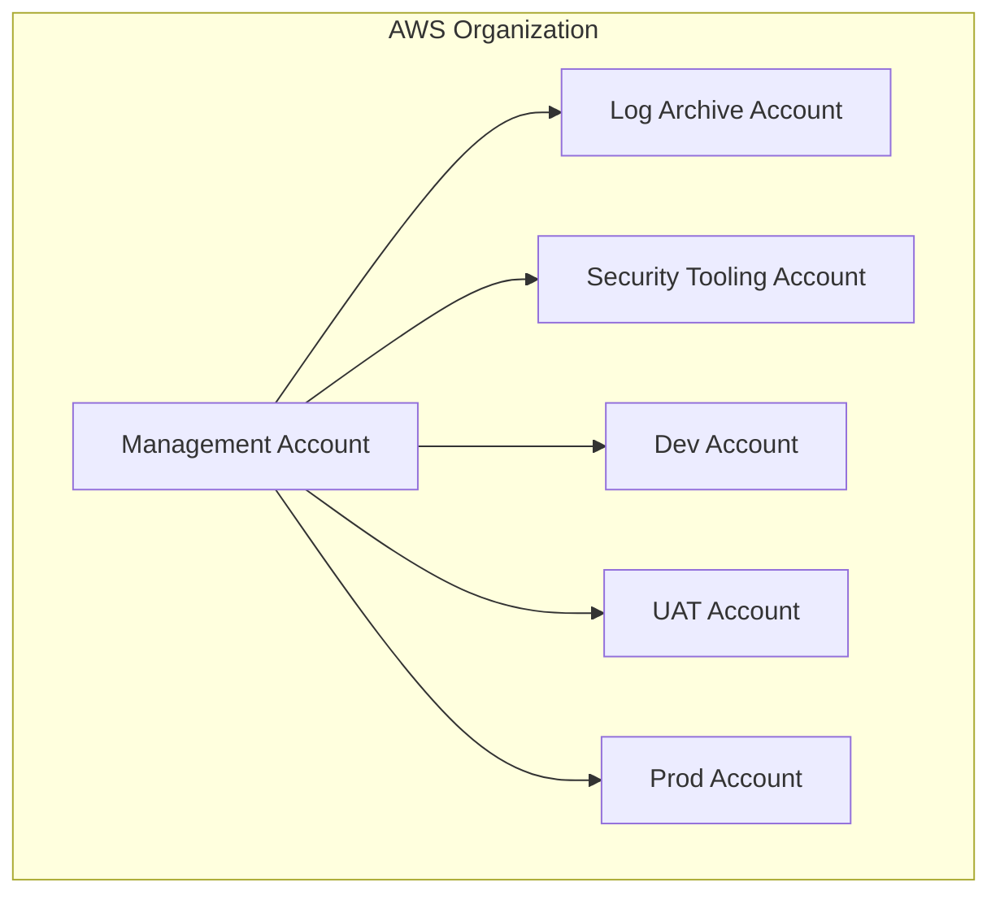

# Environment Isolation Model

This document describes the recommended model for isolating the `dev`, `uat`, and `prod` environments to ensure security, stability, and blast-radius containment. The core principle is the use of separate AWS accounts for each environment.

---

## 1. Multi-Account Strategy

For any institutional-grade deployment, a single AWS account is insufficient. We mandate a multi-account strategy where each environment (`dev`, `uat`, `prod`) is deployed into its own dedicated AWS account.

### 1.1. Identity Boundaries
*   **No Cross-Account IAM Principals:** IAM roles and users should not, by default, have cross-account access. A developer in the `Dev` account should have no permissions in the `Prod` account.
*   **Centralized Identity (Optional but Recommended):** For mature organizations, it is recommended to use AWS IAM Identity Center (formerly AWS SSO) to manage user access to the different accounts from a central directory.

### 1.2. Blast-Radius Containment
*   **Resource Isolation:** A critical failure or security breach in the `dev` environment is completely isolated and cannot affect the `uat` or `prod` environments.
*   **Billing and Quotas:** Each account has its own billing and service quotas. A resource-intensive process in `dev` cannot consume the production account's service limits.
*   **State Isolation:** The Terraform state for each environment is stored in a separate S3 bucket within that environment's account. There is no shared state between any two environments, preventing a mistake in one environment from impacting another.

---

## 2. Promotion Workflow (Dev → UAT → Prod)

The isolation model is designed to support a structured and auditable promotion workflow. All changes must flow from lower environments to higher environments.

### 2.1. Git Flow
*   **Feature Branches:** All new development and infrastructure changes should be done on feature branches.
*   **Pull Requests:** Changes are merged into the main branch via pull requests, which should require peer review and automated checks (e.g., `terraform validate`, `tfsec`).

### 2.2. Deployment Pipeline (Recommended)
A CI/CD pipeline (e.g., Jenkins, GitHub Actions, GitLab CI) is the recommended mechanism for deploying changes. The pipeline should be configured with credentials for each AWS account and should execute the following steps:

1.  **Deploy to `dev`:**
    *   The pipeline triggers on a merge to the `main` branch.
    *   It assumes an IAM role in the `Dev` account and runs `terraform apply`.
    *   Automated tests are run against the `dev` environment.

2.  **Promote to `uat`:**
    *   After successful deployment and testing in `dev`, a manual approval step is required.
    *   Upon approval, the pipeline assumes an IAM role in the `UAT` account and runs `terraform apply` using the same code artifact.
    *   User Acceptance Testing (UAT) is performed by the business in this environment.

3.  **Promote to `prod`:**
    *   After successful sign-off from UAT, a final, senior-level manual approval is required.
    *   Upon approval, the pipeline assumes an IAM role in the `Prod` account and runs `terraform apply`.
    *   The production deployment is monitored, with a clear rollback plan in place.

### 2.3. Emergency Hotfix Process
In the case of a critical production issue, a hotfix may need to bypass the full `dev` → `uat` promotion. This should be a rare exception and must follow a strict process:
*   A "hotfix" branch is created from the `main` branch.
*   The change is made and peer-reviewed with the highest priority.
*   The hotfix is deployed directly to `prod` after senior approval.
*   The hotfix branch is then immediately merged back into the `main` branch to ensure the `dev` environment is consistent with `prod`.
