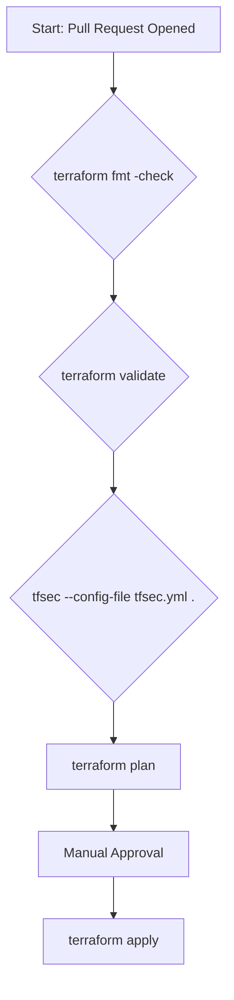

# Security Validation Pipeline

This document describes the recommended CI/CD pipeline for continuously validating the security and compliance of the infrastructure. The pipeline is designed to provide a "shift-left" approach to security, catching potential issues before they are ever deployed.

**This pipeline should be configured to run on every pull request and before any deployment to a production environment.** A failure at any stage of this pipeline must block the deployment.

---

## Pipeline Stages

---

### Stage 1: `terraform fmt -check`

*   **What is Checked:** This command checks that all Terraform code is correctly formatted according to the standard Terraform style.
*   **When it is Checked:** On every commit and pull request.
*   **What Blocks Deployment:** If any file is not correctly formatted, the pipeline fails. This ensures a consistent and readable codebase.

### Stage 2: `terraform validate`

*   **What is Checked:** This command performs a static validation of the Terraform code, checking for syntax errors, incorrect variable references, and other inconsistencies.
*   **When it is Checked:** On every pull request.
*   **What Blocks Deployment:** If there are any validation errors, the pipeline fails. This prevents syntactically incorrect code from being merged.

### Stage 3: `tfsec` (Policy-as-Code)

*   **What is Checked:** This is the core security validation stage. `tfsec` is a static analysis tool that checks the Terraform code for misconfigurations and security vulnerabilities. It uses the custom policies defined in the `tfsec.yml` file in this repository. The checks include:
    *   Ensuring critical resources have `prevent_destroy` enabled.
    *   Verifying that all resources have the mandatory set of tags.
    *   Preventing resources from being made publicly accessible.
    *   Enforcing encryption at rest for databases and storage.
    *   Ensuring the ALB uses a secure TLS policy.
*   **When it is Checked:** On every pull request and before every `terraform apply`.
*   **What Blocks Deployment:** If `tfsec` finds any `ERROR` level vulnerabilities, the pipeline must fail. This is the primary mechanism for preventing a non-compliant or insecure change from being deployed.

### Stage 4: `terraform plan` (Manual Review)

*   **What is Checked:** This command generates an execution plan that shows exactly what changes will be made to the infrastructure. The plan is posted as a comment on the pull request for human review.
*   **When it is Checked:** On every pull request.
*   **What Blocks Deployment:** A senior engineer must manually review the plan and approve it. This provides a critical human oversight step to catch any unintended or dangerous changes that the automated checks may have missed. Approval is required before the code can be merged and deployed.

### Stage 5: `terraform apply`

*   **What Happens:** After the pull request is approved and merged, the pipeline runs `terraform apply` to deploy the changes to the target environment (e.g., `dev`, `uat`, `prod`).
*   **When it Happens:** After a merge to the `main` branch (for `dev`) or after a manual promotion trigger (for `uat` and `prod`).

This pipeline provides multiple layers of automated and manual checks to ensure that all infrastructure changes are secure, compliant, and intentional.
